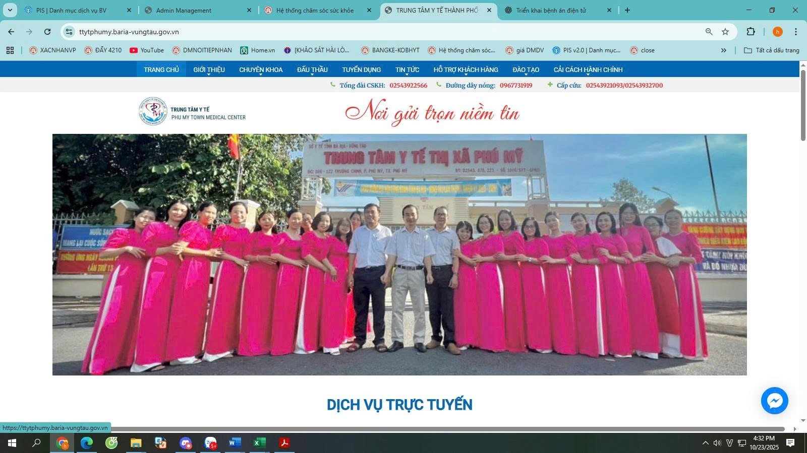

# Hướng dẫn TTYT Phú Mỹ sửa các module riêng

## 1. Sửa banner chính

<figure><figcaption></figcaption></figure>

Quản trị Thư viện Ảnh > tìm dòng Home > Chọn Sửa > Thay ảnh

<figure><figcaption></figcaption></figure>

<figure><figcaption></figcaption></figure>

## 2. Thay đổi biểu tượng Dịch vụ

1. Vào module Quản trị Quảng cáo > Dịch vụ rút gọn > Sửa

<figure><figcaption></figcaption></figure>

2. Chuyển qua tab HTML, chỗ này chị nên copy toàn bộ nội dung html sao lưu ra 1 file text kẻo sửa nhầm bị hỏng thì có cái để phục hồi
3. Tìm cái chữ fa-gavel, cái này là tên biểu tượng đấu thầu đang sử dụng.

<figure><figcaption></figcaption></figure>

4. Tra cứu trong trang này: https://fontawesome.com/v4/icons/. Thay chữ gavel thành tên của biểu tượng khác. Hiện tại chỉ hỗ trợ các icon trong danh sách này

<figure><figcaption></figcaption></figure>

5. Ví dụ đổi thành <mark style="color:yellow;">fa-flag</mark>, thì sẽ thành icon lá cờ

<figure><figcaption></figcaption></figure>

6. Bấm qua Design để xem thử, xong Cập nhật lưu lại

<figure><figcaption></figcaption></figure>

